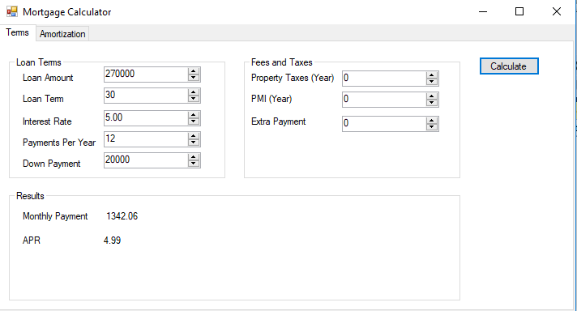
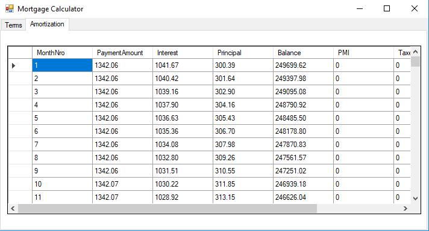

# Mortgage Payment Calculator
Its calculates the montly payment for a US fix rate mortgage loan, it also produces the amortization schedule.

## Notes
It is a WindowForm app, user enters the loan details and the app calculates the monthly payments and it displays the amortization schedule.

The amortization schedula is generated and shown to the user as a grid view.

